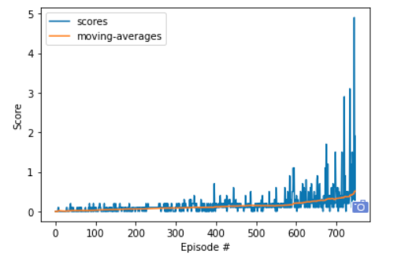

# Deep Reinforcement Learning Collaboration and Competition
## OVERVIEW
##### Tuesday, July 28, 2020

The report is for Udacity Deep Reinforcement learning course to train multi-agents to solve [Tennis](https://github.com/Unity-Technologies/ml-agents/blob/master/docs/Learning-Environment-Examples.md#tennis) environment. So multi-agents must get an average score of +0.5 (over 100 consecutive episodes, after taking the maximum over both agents).  

In this environment, two agents control rackets to bounce a ball over a net. If an agent hits the ball over the net, it receives a reward of +0.1. If an agent lets a ball hit the ground or hits the ball out of bounds, it receives a reward of -0.01. Thus, the goal of each agent is to keep the ball in play.

## Algorithm
I implemented the Multi-Agent Deep Deterministic Policy Gradient [(MADDPG)](https://papers.nips.cc/paper/7217-multi-agent-actor-critic-for-mixed-cooperative-competitive-environments.pdf) to solve this episodic task, It extended from the Deep Deterministic Policy Gradients [(DDPG)](https://arxiv.org/pdf/1509.02971.pdf) and used project2 "continuous-control" as a baseline.

<div align="center">

</div>
<div align="center">
<u> **Figure 1** </u>: **Algorithm Frame**<br>  
</div>
There are tow agents,The neural network model as 'actor' and 'critic' for each agent. I needed to implement the centralized traning with decentralized execution. So Using all information to optimize critic parameters and actor local parameters. 

The states set that is all information from environment were inputed agents to get actions set. The agent return the corresponding action. Then Agents interacted with environment using A <A0, A1> . 

```python
            A0 = agent0.act(states, add_noise=True)                 # get A0 shape(1, 2)
            A1 = agent1.act(states, add_noise=True)                 # get A1 shape(1, 2)
            actions = np.concatenate((A0, A1), axis=0).flatten()    # combinate A0, A1 as A
```

The rewareds determine the behavior of the corresponding agent. So I inputed rewards[0] to agent0 and rewards[1] to agent1 to train the agents.

```python
            agent0.step(states, actions, rewards[0], next_states, dones[0])  #  input <S, A, R0, S', done0> 
            agent1.step(states, actions, rewards[1], next_states, dones[1])  #  input <S, A, R1, S', done1>

```

The actor here is used to approximate the optimal policy deterministically. The actor is learning the argmax U(s)  which is the best action. Because using all information to train agents, agent0 combined <A', A1> as actions and agent1 combined <A0, A'> as actions. then the states and actions were inputted critic. It is important to input the corresponding reward to calculate Q_targets through TD method.

```python
        # ---------------------------- update critic ---------------------------- #
        # Get predicted next-state actions and Q values from target models
        actions_next = self.actor_target(next_states)
        if self.agent_id == 0:
            actions_next = torch.cat((actions_next, actions[:,2:]), dim=1)
        else:
            actions_next = torch.cat((actions[:,:2], actions_next), dim=1)

        Q_targets_next = self.critic_target(next_states, actions_next)
        Q_targets = reward + (gamma * Q_targets_next * (1 - done))
```

```python
        # ---------------------- update actor ------------------------- #
        # Compute U and package A0', A1 or A0 , A1'
        actions_pred = self.actor_local(states)
        if self.agent_id == 0:
            actions_pred = torch.cat((actions_pred, actions[:,2:]), dim=1)
        else:
            actions_pred = torch.cat((actions[:,:2], actions_pred), dim=1)
```

## Neural network model

When I structured the model as 

**Actor**:
<table style="width:50%"> 
    <tr>
    <td > **N0** </td> 
           <td > (1, 48) </td> 
    </tr> 
    <tr>
    <td > **N1** </td> 
           <td > (256, 48) </td> 
    </tr> 
    <tr>
    <td > **N2** </td> 
           <td > (256, 256) </td> 
    </tr>
    <tr>
    <td > **N3** </td> 
           <td > (2, 256) </td> 
    </tr> 
</table>

**Critic**:
<table style="width:50%"> 
    <tr>
    <td > **N0** </td> 
           <td > (1, 48) </td> 
    </tr> 
    <tr>
    <td > **N1** </td> 
           <td > (256+4, 48) </td> 
    </tr> 
    <tr>
    <td > **N2** </td> 
           <td > (256, 256+4) </td> 
    </tr>
    <tr>
    <td > **N3** </td> 
           <td > (1, 256) </td> 
    </tr> 
</table>

I defined "nn.BatchNorm1d" between each layer. The [Batch Normalization](https://arxiv.org/pdf/1502.03167.pdf) technology could accelerate Deep Network Training. 

#### Hyper-parameter

```
BUFFER_SIZE = int(1e6)    # replay buffer size
BATCH_SIZE = 128          # minibatch size
GAMMA = 0.99              # discount factor
TAU = 6e-2                # for soft update of target parameters
LR_ACTOR = 1e-3           # learning rate of the actor
LR_CRITIC = 1e-3          # learning rate of the critic
WEIGHT_DECAY = 0          # L2 weight decay
EPSILON = 1               # epsion greedy to exploration actions space
EPSILON_DEC = 0.001       # epsion decay for balancing exploration, exploitation
```

## Results
The tennis task was solved in episode 748. 
<div align="center">

</div>
<div align="center">
<u> **Figure 2** </u>: ** Watch agents **<br> 
</div>
<br>             
<div align="center">

</div>
<div align="center">
<u> **Figure 3** </u>: ** Episodes log **<br> 
</div>
<br>             
<div align="center">

</div>
<div align="center">
<u> **Figure 4** </u>: **Rewards histogram**<br> 
</div>

## Conclusion
The multi-agent DDPG algorithm is a centralized training and decentralized execution algorithm that be good performance in the  Mixed Cooperative-Competitive Environments.

Another thing I learned was that I needed to look at all available returned information to determine how well the model was learning. What confused me at the beginning was that no matter how to adjust the parameters, the agent always gets 0 rewards. It was intuitively seen from the score that the model did not learn. I found out what the problem was, because I was based on the project2 as the baseline. The print message is {:.1f}, this project rewards' scale were different.  I needed to change {:.4f} for this task.


## Future enhancements
- Implement "(Optional) Challenge: Play Soccer". 
- Explore and use [(MADDPG)](https://papers.nips.cc/paper/7217-multi-agent-actor-critic-for-mixed-cooperative-competitive-environments.pdf)in other environments.
- Explore whether multiple games can be played simultaneously to train agents
